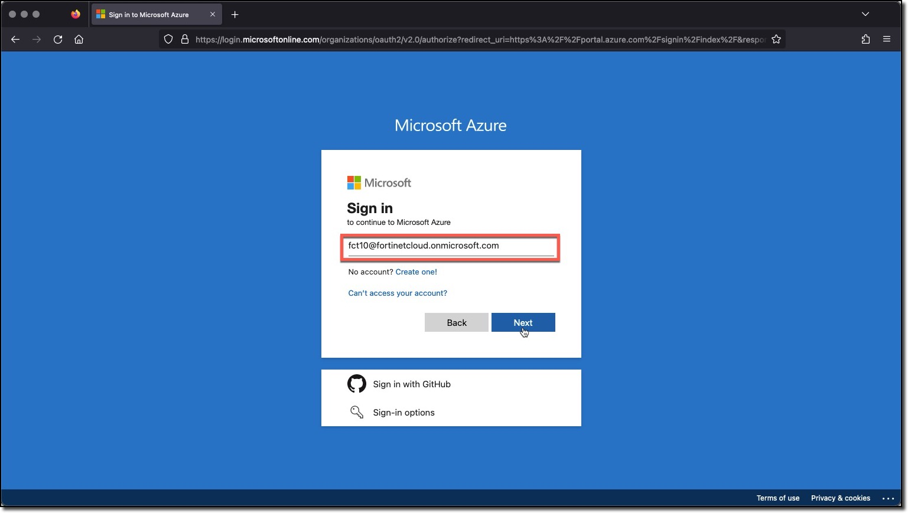
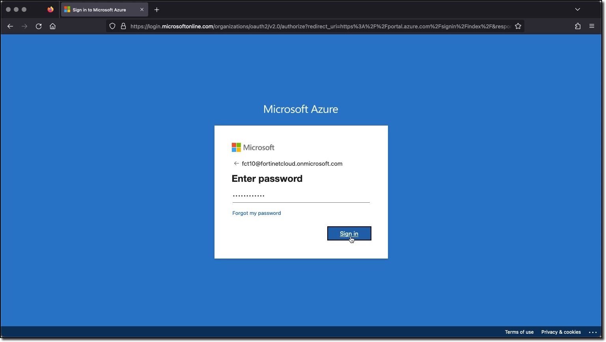
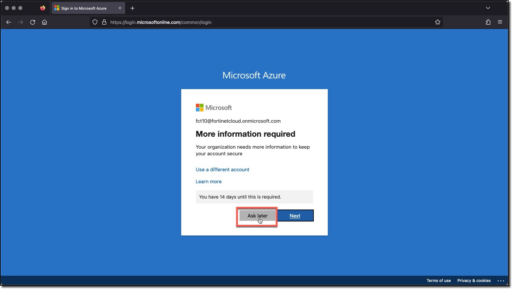
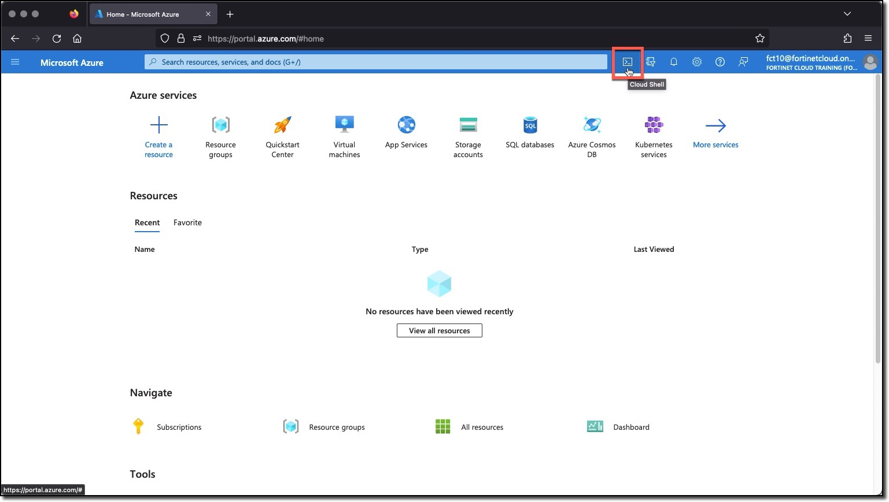
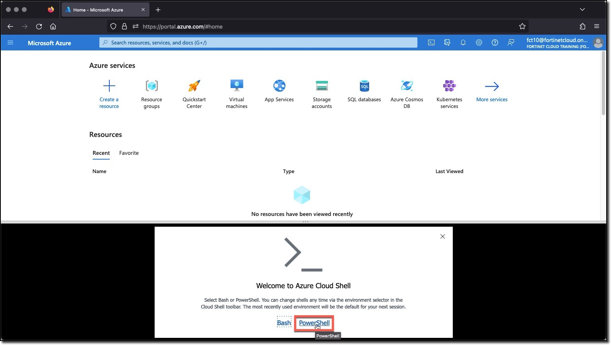
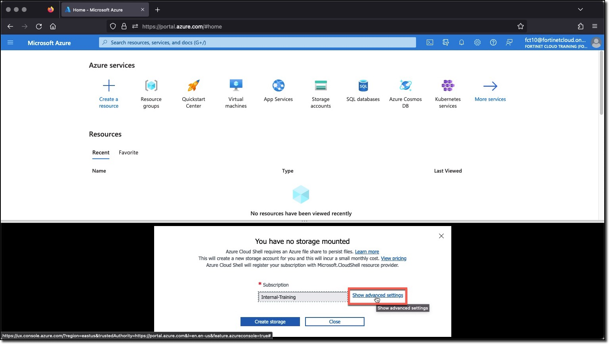
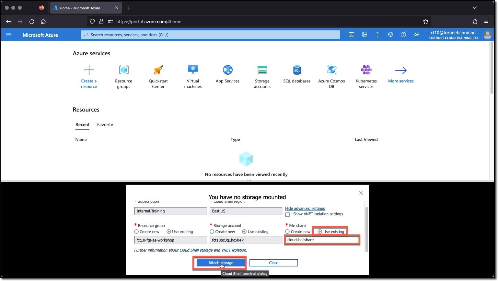
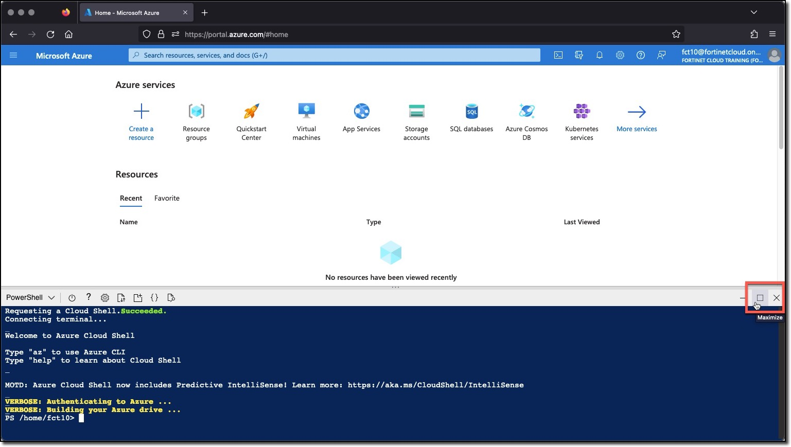

### Task 1 - Setup your AzureCloud Shell

* __Login__ to Azure Cloud Portal [https://portal.azure.com/](https://portal.azure.com/) with the provided login/password

    
    

* __Click__ the  "Ask Later" button __do not click__ the "Next" button

    

* __Click__ on Cloud Shell icon on the Top Right side of the portal

    

* __Select__ __PowerShell__
    

* __Click__ on "Show advanced settings"

    
* __Select__
  * __Use existing__ Resource Group  - it ___should___ auto populate with USERXX-fgt-as-workshop (USERXX is your Username)
  * __Use existing__ Storage account - it ___should___ auto populate with USERXX############ (############ is a random string)
  * __Use existing__ File Share  - type __cloudshellshare__
* __Click__ "Attach Storage"

    

* You now have access to Azure Cloud Shell console. Maximize the console window

    
