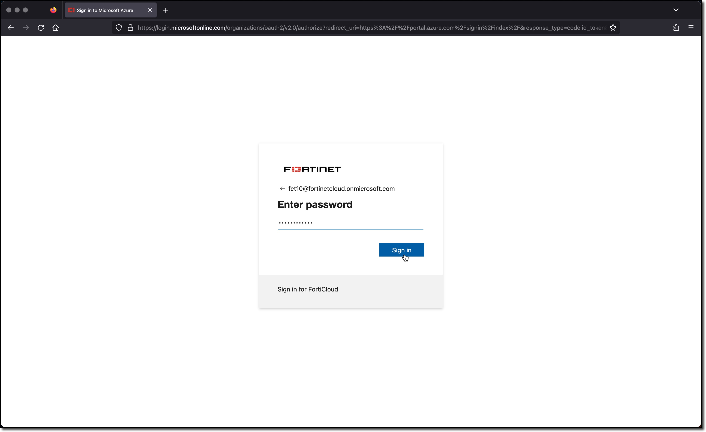

### Task 1 - Setup your AzureCloud Shell

* __Login__ to Azure Cloud Portal [https://portal.azure.com/](https://portal.azure.com/) with the provided login/password

    
    

* __Click__ on Cloud Shell icon on the Top Right side of the portal

    

* __Click__ __PowerShell__
    

* __Click__ on "Show advanced settings"

    

> The field *Storage Account* should auto populate. If it does not, it is because the "Cloud Shell Region" field is not set to the Region where the *Storage Account* is located. Please try __Central US__, __East US__, and __West US__

* __Select__
  * __Use existing__ Resource Group
    * Field __should__ auto populate with USERXX-fgt-as-workshop (USERXX is your Username)

  * __Use existing__ Storage account
    * Field __should__ auto populate with USERXX############ (############) is a random string

  * __Use existing__ File Share
    * This field __will not__ auto populate
    * type `cloudshellshare`

* __Click__ "Attach Storage"

    

* You now have access to Azure Cloud Shell console.

* Maximize the console window

    
