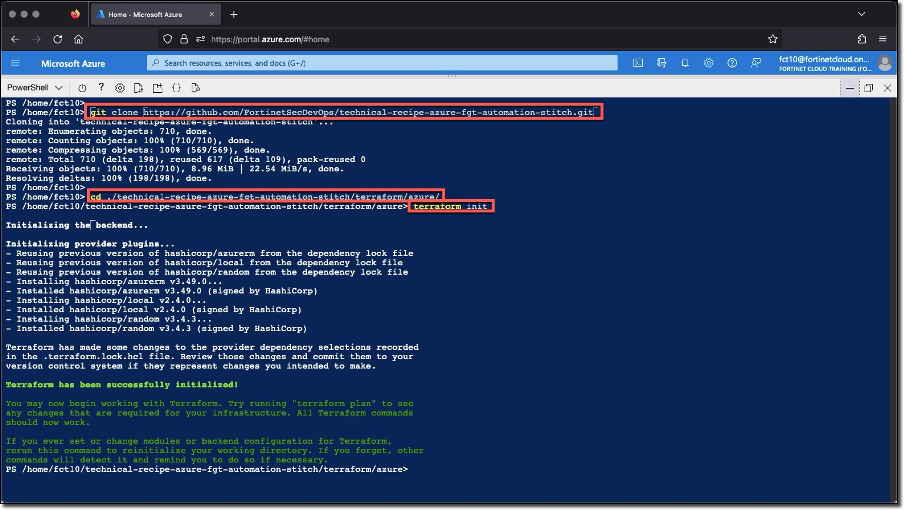
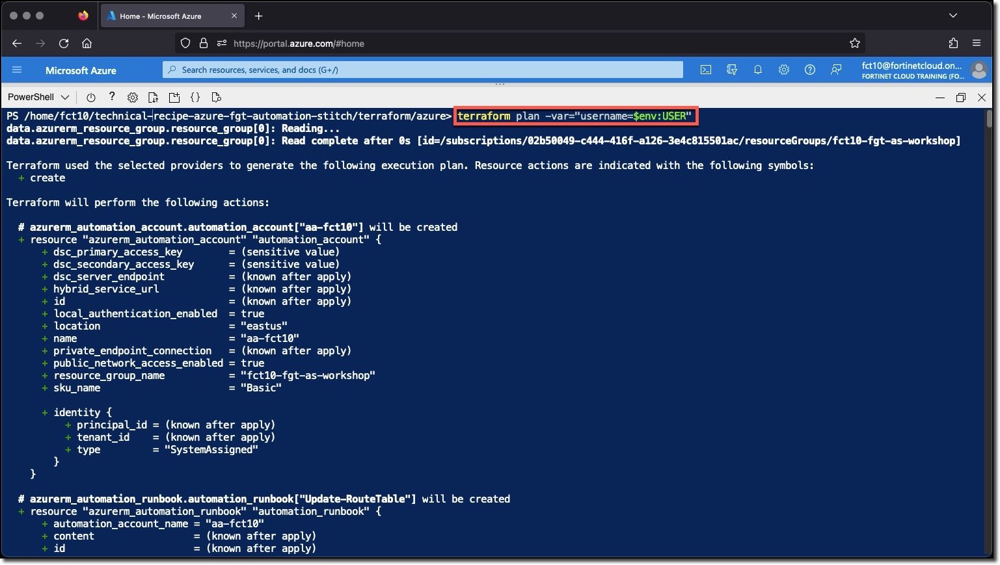

### Task 2 - Run the Terraform Deployment

Perform the following step in your Cloudshell console to create your environment.

1. Clone the Github repo
1. Change directory to the `technical-recipe-azure-fgt-automation-stitch/terraform/azure` folder
1. Run `terraform init`
1. Run `terraform plan` for your `username`
1. Run `terraform apply` for your `username`

> **Copy and paste these commands into your Cloud Shell console.**
> The terraform variable `username` will be populated with the value of the environment variable `USER`

```sh
git clone https://github.com/FortinetSecDevOps/technical-recipe-azure-fgt-automation-stitch
cd ./technical-recipe-azure-fgt-automation-stitch/terraform/azure
terraform init
terraform plan -var="username=$env:USER"
terraform apply -var="username=$env:USER" -auto-approve

```

  
  
  
