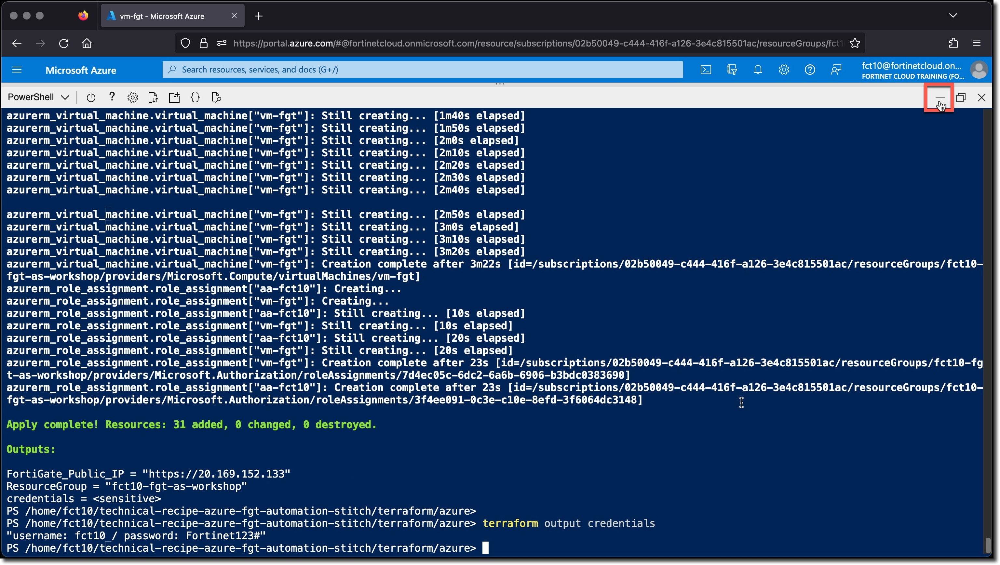
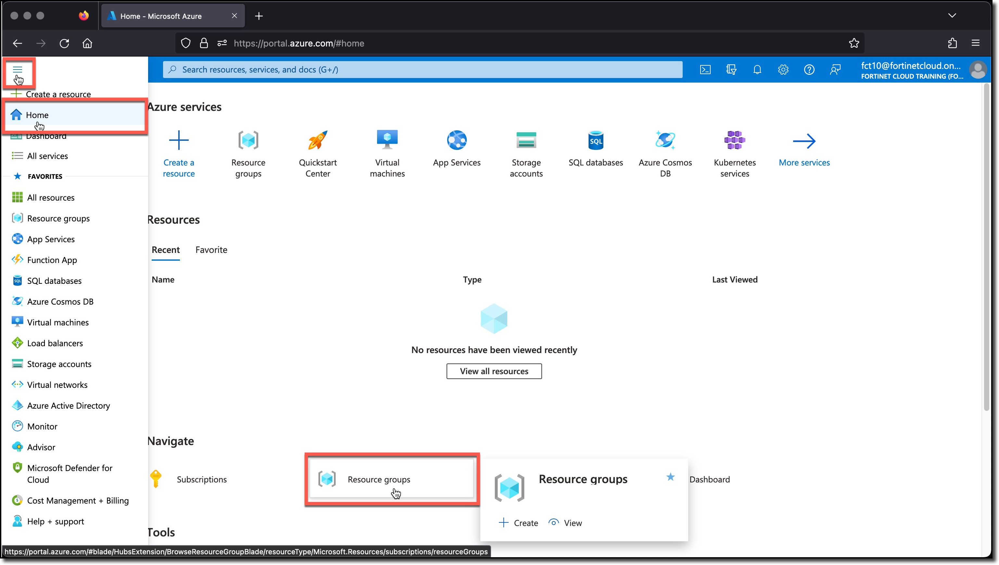
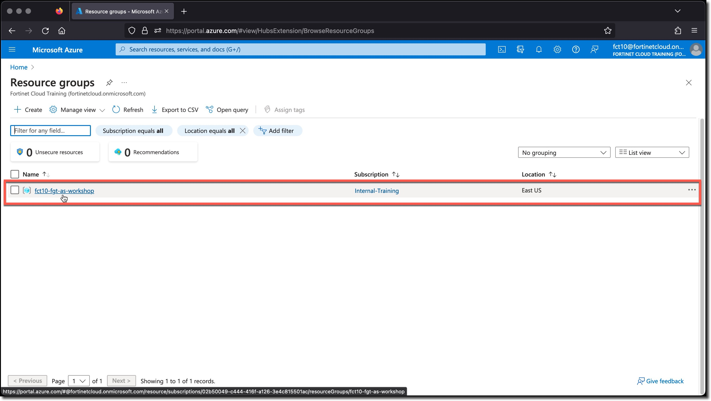
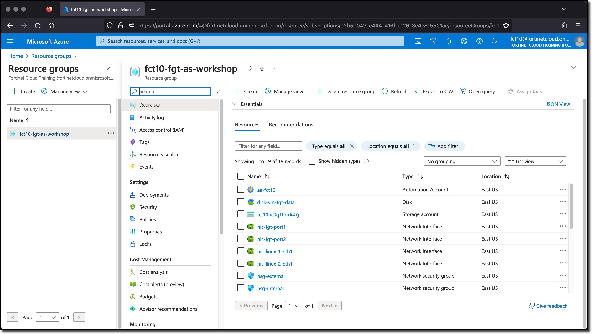

### Task 3 - Terraform Verification

  1. Using the Terraform output, verify that you have Web access to the FortiGate.

      

      * Terraform output can be redisplayed at any point as long as you are in the `./technical-recipe-azure-fgt-automation-stitch/terraform/azure` directory, by using the command `terraform output`
      * To view the FortiGate and Linux VM login credentials use the command `terraform output credentials`

        ```sh
        cd
        cd ./technical-recipe-azure-fgt-automation-stitch/terraform/azure
        terraform output
        terraform output credentials
        ````

  2. Review the Resource Group and created components.

      * 1 - Automation Account
      * 4 - Disks for the VMs
      * 4 - Network Interfaces for the VMs
      * 2 - Network security groups
      * 1 - Public IP address for the FortiGate
      * 1 - Route table
      * 1 - Runbook
      * 1 - Storage account
      * 3 - Virtual Machines - 1 FortiGate, 2 Linux VMs
      * 1 - Virtual Network - Containing 3 Subnets - snet-internal, snet-external, snet-protected

      ***

      1. __Minimize__ the Cloudshell console window
      1. __Click__ the slide-drawer menu icon (sometimes referred to as the hamburger menu )
      1. __Click__ Home
      1. __Click__ Resource Groups
      1. __Click__ your Resource Group `USERXX-fgt-as-workshop`

      
      
      
      
