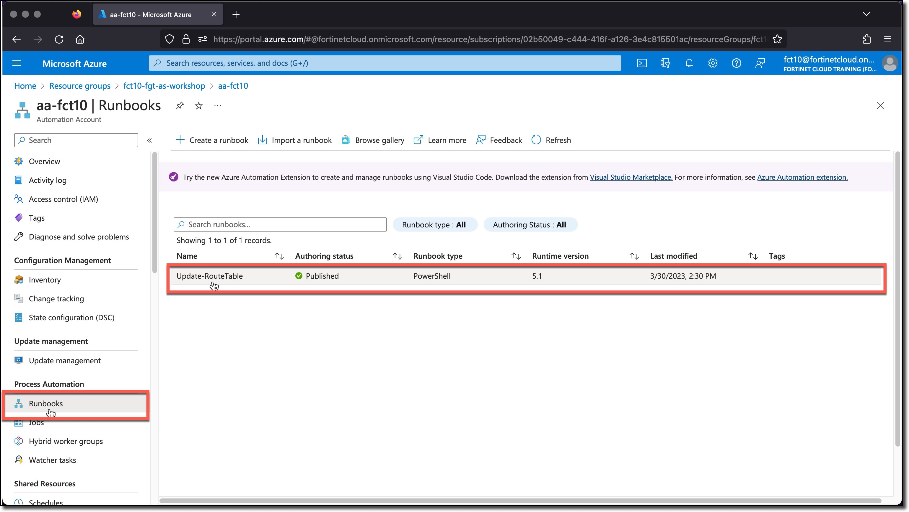

## Azure Automation

Automation in Azure can be accomplished in a number of ways, Logic Apps, Function Apps, Runbooks, etc. Each of the automation methods can be triggered in a number of ways, for example Events, Webhooks, and Schedules.

An Azure Runbook is just a script, in this case PowerShell, that the Automation Account can run. The Actions the Runbook can perform are controlled by the roles (what actions are allowed) and scope (where those actions can be performed) that have been granted to the Automation Account, via the Automation Account Identity.

The Runbook Actions are provided by PowerShell Modules that have been imported into the Automation Account. The PowerShell Modules are libraries of commands called Cmdlets that are grouped into several domains. For example, Accounts, Automation, Compute, Network, and Resources.

The Runbook created during the Terraform deployment process was imported from the Github repository for this Workshop. The function of the Runbook is to add or remove a route from a route table. The details of the route are related to the IP address of a VM that has been tagged with a specific tag and value.

The Runbook is triggered via a webhook when a VM with a specific tag with a specific value is observed by the FortiGate Azure SDN connector. The tag specifics and SDN Connector are covered in later tasks.

### Task 1 - Review Azure Automation Account

1. **Click** the Automation Account **aa-USERXX**
1. **Click** Runbooks
1. **Click** Update-RouteTable

The overview shows details bout the Runbook. Important items to note are the Runbook type and version. In this case the Runbook type is PowerShell and the version is 5.1

The Runbook can be executed in several ways.

* Manually
* Linked to a schedule
* Via a Webhook

  
