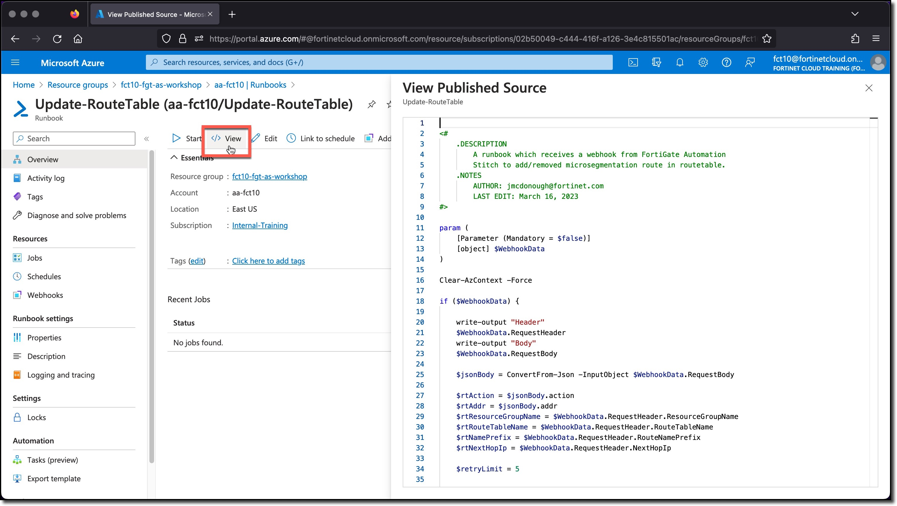

### Task 2 - View Azure Automation Runbook

1. **Click** View to view the runbook PowerShell code

    

    The code has several sections

    * Lines 1-10: Indicate the functionality, author and last edit.
    * Lines 11-16: Define a single mandatory parameter named `$webhookdata` and clears any passed contextual information.
    * Lines 18-85: Several actions take place
    * Was the Runbook triggered by a webhook or not
    * Parse the webhook body
    * Determine if a route being added, removed or if an invalid operation was indicated.
        * For both the added and removed option the command `Connect-AzAccount -Identity -Force` is run to allow the PowerShell to use the Automation account Identity to perform actions in the Azure environment, e.g., adding/removing a route from a route table.

    A Runbook can be executed by the Automation Account, however if the Runbook attempts to perform an action that the Automation Account identity does not have the privilege to do then the actions will fail. The initial privilege setting of the RunAutomation Account identity is **none**.

    This Runbook expects to be executed only via a Webhook with a payload provided by the FortiGate.
