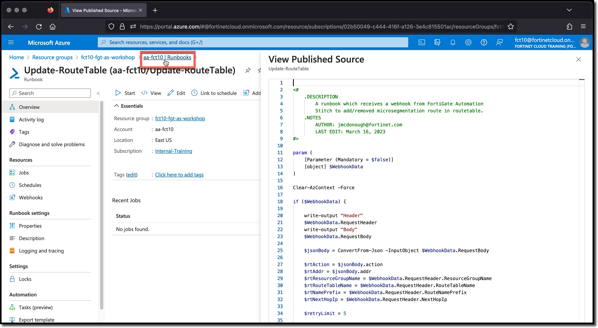
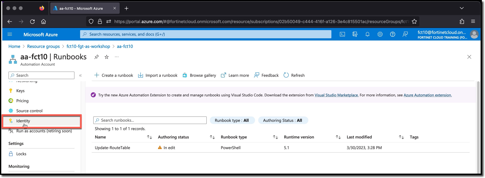
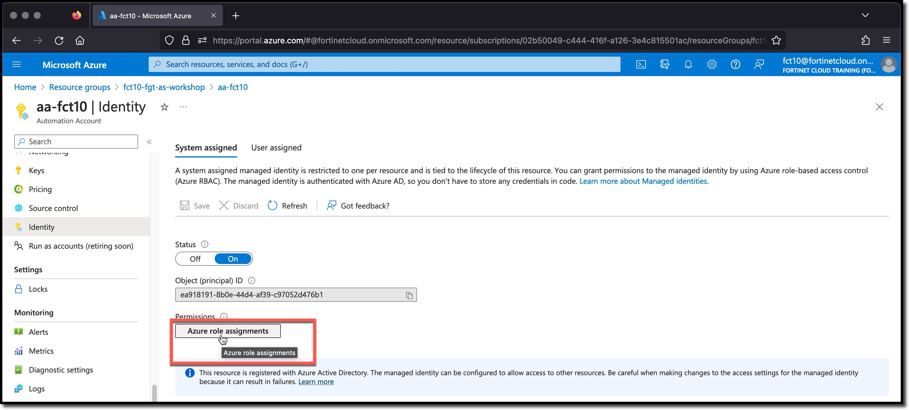
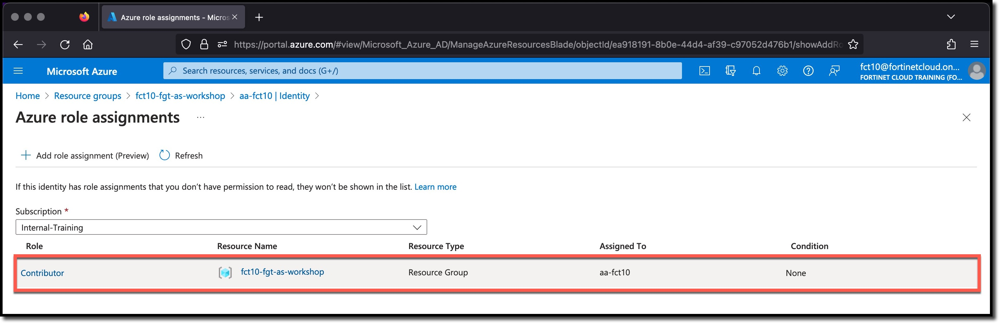

## Azure Identity

Azure uses identity with many objects in the cloud environments. Identity is a way to provide an object with permissions. As mentioned previously the Identity has no permissions until a role is assigned. Permissions are given by assigning one or more Azure Roles to the object. The role assigned permissions are associated to a scope.

Azure's definition of a role is:

* A Role is a collection of permissions

Azure's definition of a scope is:

* A Scope is a set of resources that the role assignment applies to. Scope has levels that are inherited at lower levels. For example, if you select a subscription scope, the role assignment applies to all resource groups and resources in the subscription.

### Task 3 - Review Azure Identity

1. **Click** the Automation Account | Runbooks in the breadcrumb links **aa-USERXX | Runbooks**
1. **Scroll** down in the left-hand navigation to "Identity"
1. **Click** Identity
1. **Click** Azure Role Assignments

The Azure Automation Account Identity has the role of "Contributor" with a scope of the Resource Group **USERXX-fgt-as-workshop**

This means that any action a Contributor Role can perform can be done by all Runbooks associated with this Azure Automation Account to all of the resources in the scoped Resource Group

