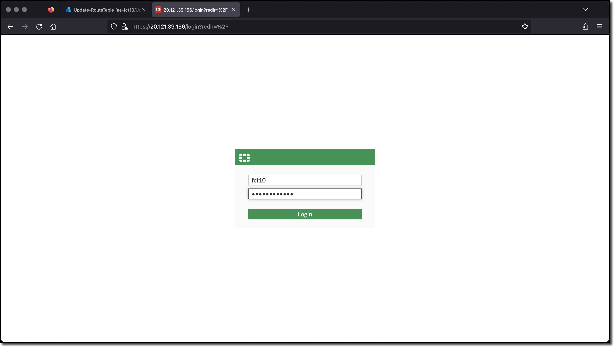
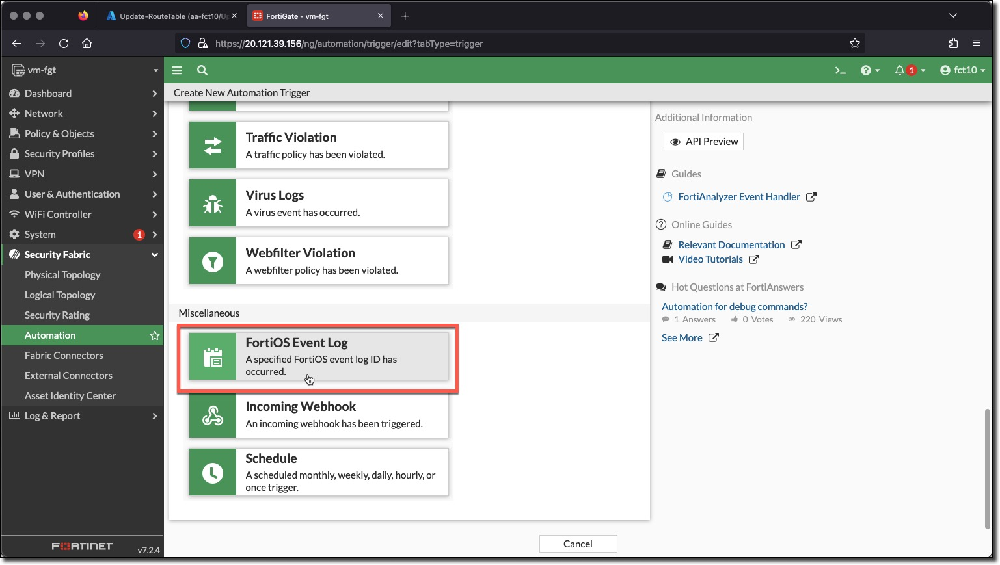
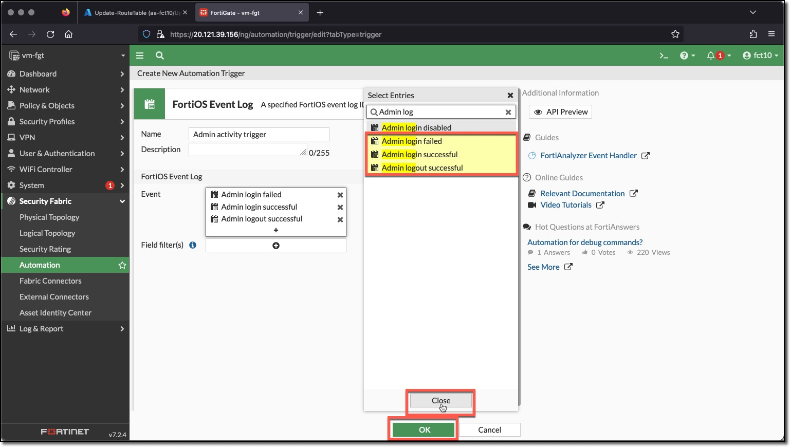
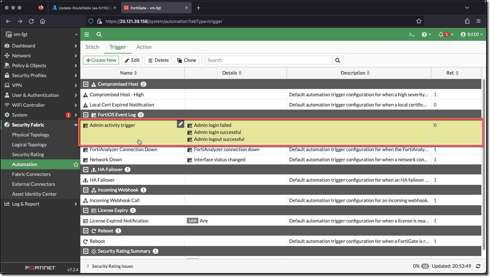

### Task 1 - Create Automation Trigger

This task creates the trigger for when an Admin logs in or out or fails to login.

1. **Login** to the FortiGate using the IP address and credentials from the Terraform output.
1. **Click** through any opening screens for FortiGate setup actions, no changes are required.
1. **Click** "Security Fabric"
1. **Click** "Automation"
1. **Click** "Trigger"
1. **Click** "Create New"

  
  

1. **Click** "FortiOS Event Log" in **Miscellaneous** section
1. **Enter**
    * Name: `Admin activity trigger`
1. **Click** "+" in Event field
1. **Enter** search term "Admin Log" in "Select Entries"
1. **Click** these entries to add to the Event field
    * Admin Login failed
    * Admin Login successful
    * Admin Logout successful
1. **Click** Close
1. **Click** OK

  
  
  
