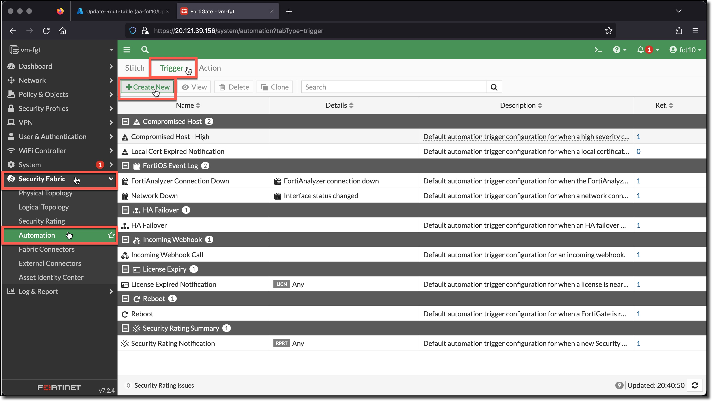
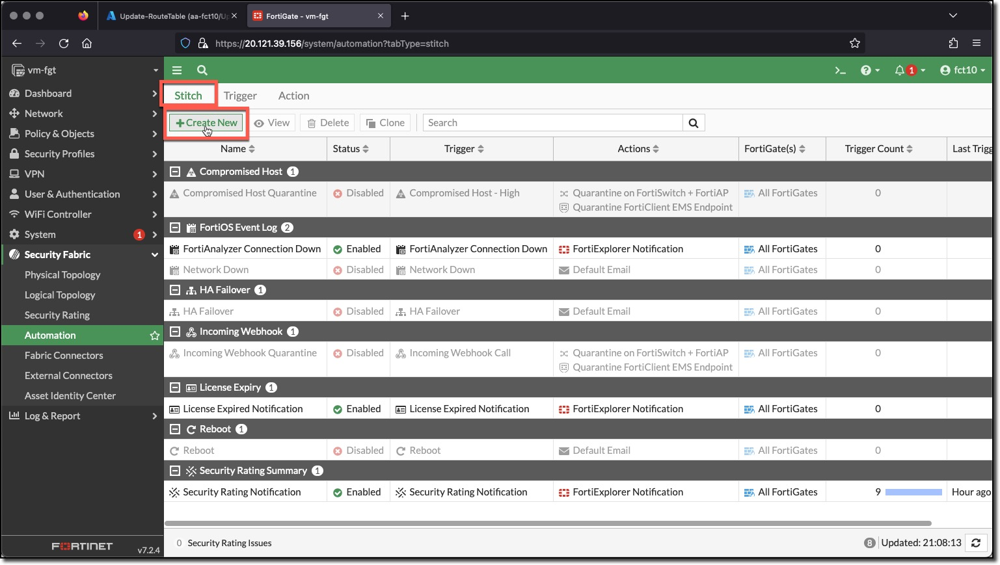
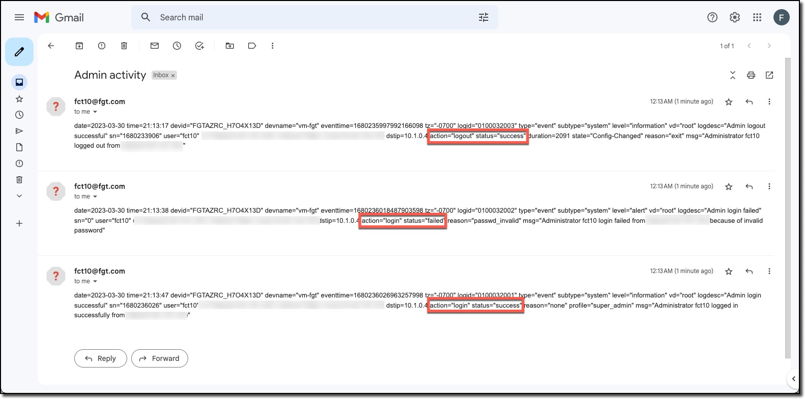

### Task 1 - Create Automation Trigger

This task creates the trigger for when an Admin logs in or out or fails to login.

1. **Login** to the FortiGate using the IP address and credentials from the Terraform output.
1. **Click** through any opening screens for FortiGate setup actions, no changes are required.
1. **Click** "Security Fabric"
1. **Click** "Automation"
1. **Click** "Trigger"
1. **Click** "Create New"

  
  

1. **Scroll** to the bottom
1. **Click** "FortiOS Log Event"

1. **Enter**
    * Name: "Admin activity trigger"
1. **Click** "+" in Event field
1. **Enter** search term "Admin Log" in "Select Entries"
1. **Click** these entries to add to the Event field
    * Admin Login failed
    * Admin Login successful
    * Admin Logout successful
1. **Click** Close
1. **Click** OK

  
  
  

### Task 2 - Create Automation Action

1. **Click** "Action"
1. **Click** "Create New"
1. **Scroll** to the Notifications actions
1. **Click** "Email"

  
  

1. **Enter**
    * Name: "Admin activity action"
    * From: "USERXX@ftg.com" <-- does not need to be a valid email
    * To: a valid email address to receive the email
    * Subject: "Admin activity"
1. **Click** OK

  
  

### Task 3 - Create Automation Stitch

1. **Click** "Action"
1. **Click** "Create New"

  

1. **Enter**
    * Name: "Admin activity stitch"
1. **Click** "Add Trigger"
1. **Click** "Admin activity trigger" in "Select Entries"
1. **Click** "Apply"
1. **Click** "Add Action"
1. **Click** "Admin activity action" in "Select Entries"
1. **Click** "Apply"
1. **Click** "OK"

  
  
  

### Task 4 - Test the Automation Stitch

1. **Logout**
1. **Login** with an incorrect password
1. **Login** with an the correct password

  
