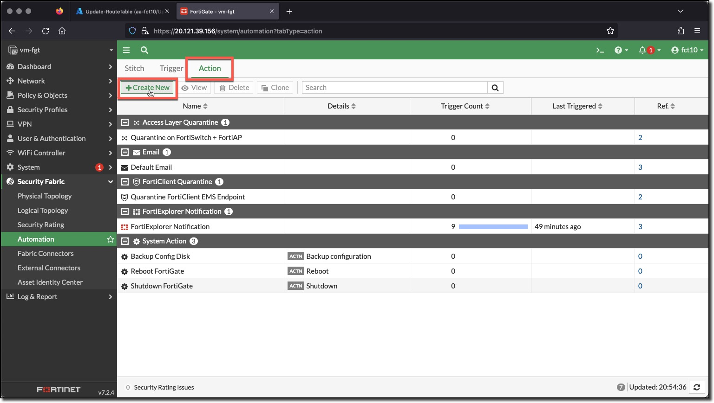
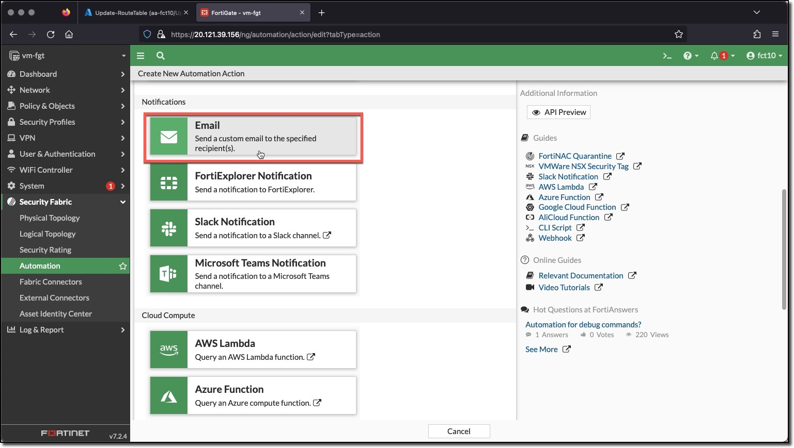
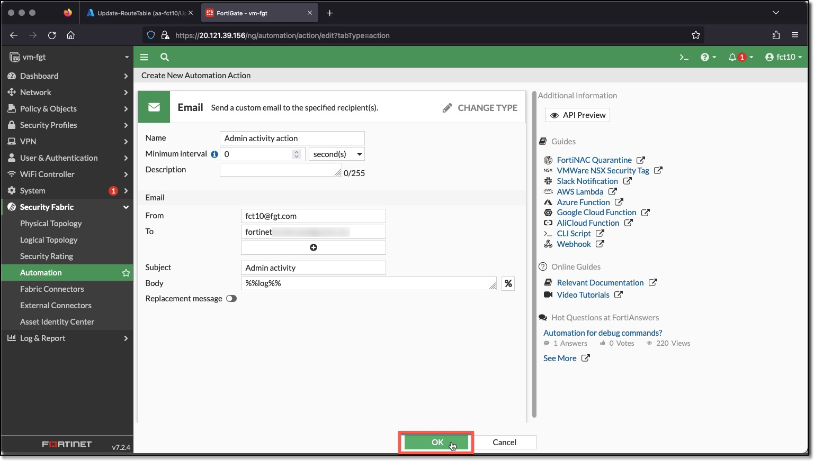
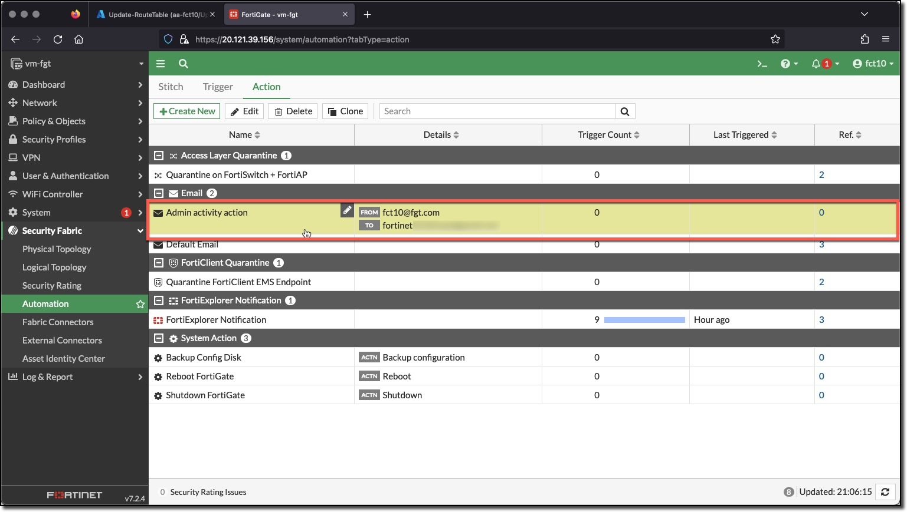

### Task 2 - Create Automation Action

This task creates the action for when an Admin logs in or out or fails to login.

1. **Click** "Action"
1. **Click** "Create New"
1. **Click** "Email" in **Notifications**

  
  

1. **Enter**
    * Name: `Admin activity action`
    * From: "USERXX@ftg.com" <-- **does not need to be a valid email**
    * To: a valid email address to receive the email
    * Subject: `Admin activity`
1. **Click** OK

  
  
