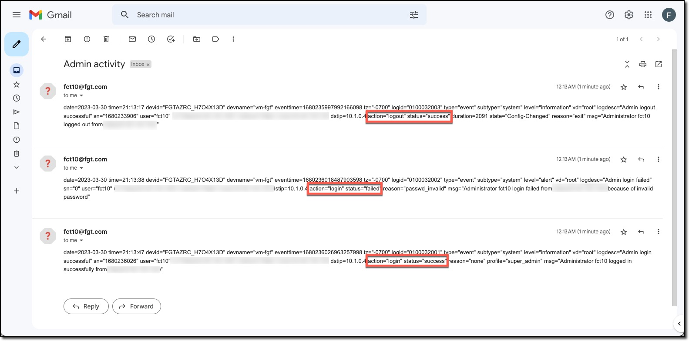

### Task 2 - Create Automation Action

This task creates the action to send an email indicating the Admin activity.

1. **Click** "Action"
1. **Click** "Create New"
1. **Scroll** to the Notifications actions
1. **Click** "Email"

  
  

1. **Enter**
    * Name: "Admin activity action"
    * From: "USERXX@ftg.com" <-- does not need to be a valid email
    * To: a valid email address to receive the email
    * Subject: "Admin activity"
1. **Click** OK

  
  

### Task 3 - Create Automation Stitch

1. **Click** "Action"
1. **Click** "Create New"

  

1. **Enter**
    * Name: "Admin activity stitch"
1. **Click** "Add Trigger"
1. **Click** "Admin activity trigger" in "Select Entries"
1. **Click** "Apply"
1. **Click** "Add Action"
1. **Click** "Admin activity action" in "Select Entries"
1. **Click** "Apply"
1. **Click** "OK"

  
  
  

### Task 4 - Test the Automation Stitch

1. **Logout**
1. **Login** with an incorrect password
1. **Login** with an the correct password

  
