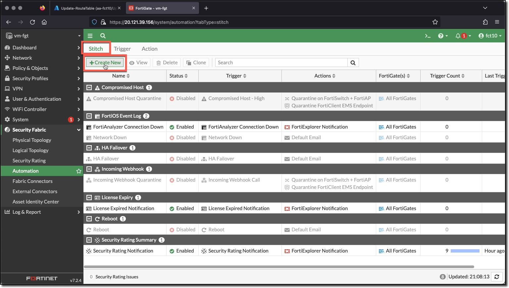
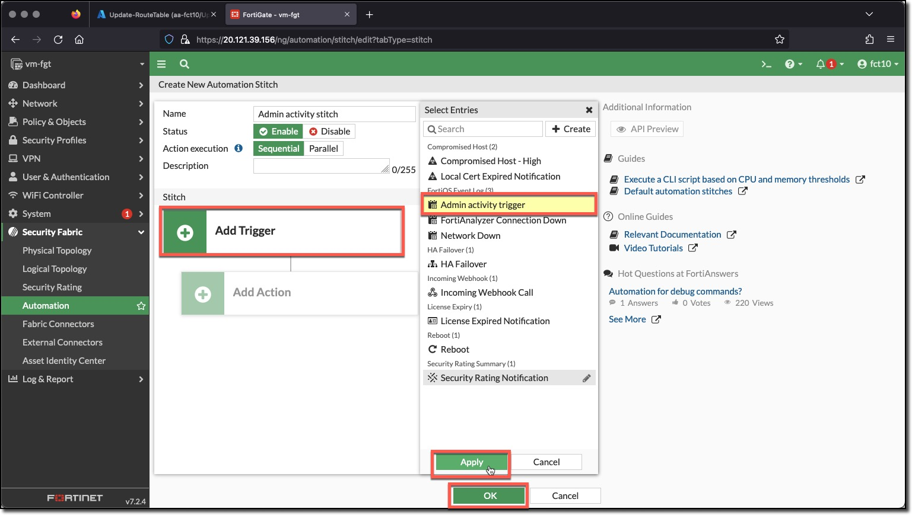
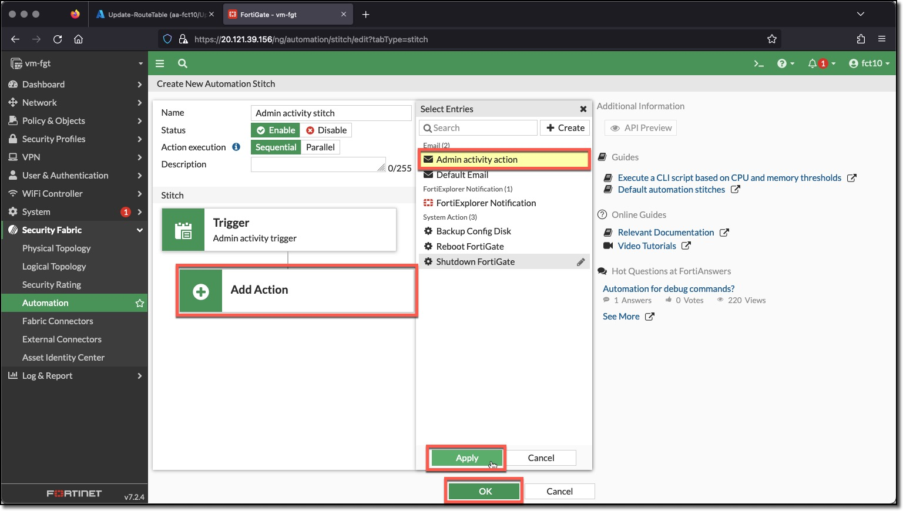
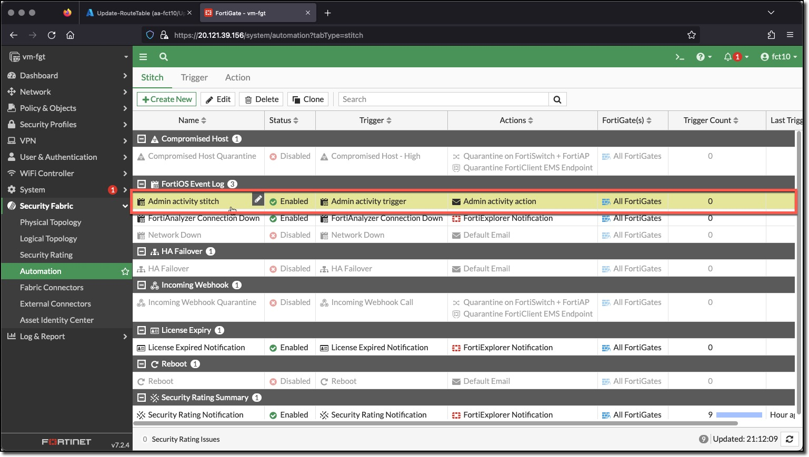

### Task 3 - Create Automation Stitch

This task creates the stitch for when an Admin logs in or out or fails to login.

1. **Click** "Stitch"
1. **Click** "Create New"

  

1. **Enter**
    * Name: `Admin activity stitch`
1. **Click** "Add Trigger"
1. **Click** "Admin activity trigger" in "Select Entries"
1. **Click** "Apply"
1. **Click** "Add Action"
1. **Click** "Admin activity action" in "Select Entries"
1. **Click** "Apply"
1. **Click** "OK"

  
  
  
