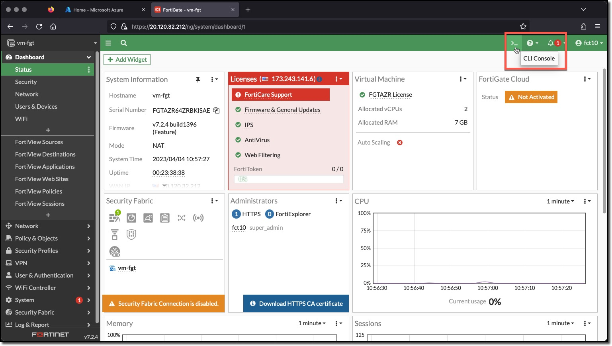
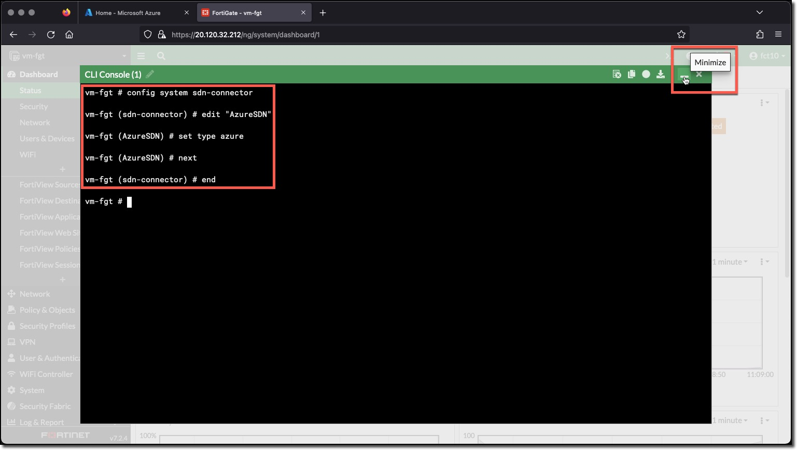

### Task 1 - Create FortiGate Azure SDN Connector and Dynamic Address Objects

The completed Automation Stitch trigger will be when a log is recorded for the following events:

* Dynamic address added
* Dynamic address removed

These log events are recorded when a FortiGate Dynamic Address is updated by adding or removing an address. FortiGate Dynamic Addresses are updated when the conditions of the Dynamic Address filter are met.

The Dynamic address filters can utilize the data returned from the FortiGate Azure SDN Connector. The filters can match on several aspects of the Azure environment. The Dynamic address filters in this task will match on Azure Tags and Values.

The configurations are presented as a combination of FortiGate CLI commands and screenshots of the configured object.  All of the command blocks can be copied and pasted into the FortiGate CLI console.

1. **Login** to the FortiGate using the IP address and credentials from the Terraform output.
1. **Click** through any opening screens for FortiGate setup actions, no changes are required.
1. **Click** the CLI Console
1. **Enter** the following CLI commands to create an Azure SDN Connector named "AzureSDN"

    ```bash
    config system sdn-connector
        edit "AzureSDN"
            set type azure
            set status disable 
        next
    end
    ```

    
    

The Azure SDN Connector is set to **disable** for now, it will be set to **enable** in Task 5. The SDN Connector needs to exist for the Dynamic Addresses to refer to it, but at this point in the exercise it needs to remain disabled.

#### Create Dynamic Addresses

1. Use the FortiGate CLI Console to enter the following commands
1. Create **AppServers** Address

    ```bash
    config firewall address
        edit "AppServers"
            set type dynamic
            set sdn "AzureSDN"
            set filter "Tag.ComputeType=AppServer"
        next
    end
    ```

1. Create **DbServers** Address

    ```bash
    config firewall address
        edit "DbServers"
            set type dynamic
            set sdn "AzureSDN"
            set filter "Tag.ComputeType=DbServer"
        next
    end
    ```

1. Create **WebServers** Address

    ```bash
    config firewall address
        edit "WebServers"
            set type dynamic
            set sdn "AzureSDN"
            set filter "Tag.ComputeType=WebServer"
        next
    end
    ```

For the time being all of the Dynamic Addresses will remain unresolved, because the Azure SDN Connector is currently set to *disable*. You will view the updated **WebServers** Address in Task 5 after the Azure SDN Connector is set to *enable*
