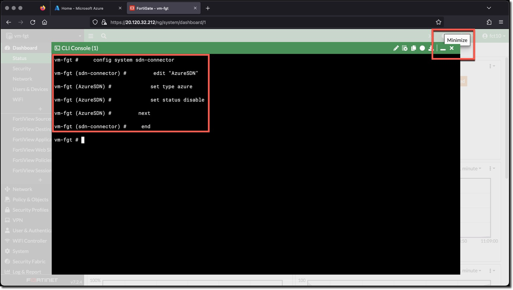
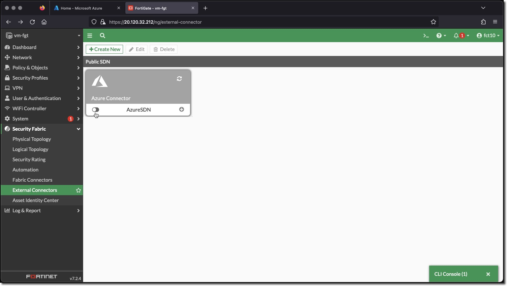

### Task 1 - Create FortiGate Azure SDN Connector and Dynamic Address Objects

The completed Automation Stitch trigger will be when a log is recorded for the following events:

* Dynamic address added
* Dynamic address removed

These log events are recorded when a FortiGate Dynamic Address is updated by adding or removing an address. FortiGate Dynamic Addresses are updated when the conditions of the Dynamic Address filter are met.

The Dynamic address filters can utilize the data returned from the FortiGate Azure SDN Connector. The filters can match on several aspects of the Azure environment. The Dynamic address filters in this task will match on Azure Tags and Values.

The configurations are presented as a combination of FortiGate CLI commands and screenshots of the configured object.  All of the command blocks can be copied and pasted into the FortiGate CLI console.

1. **Login** to the FortiGate using the IP address and credentials from the Terraform output.
1. **Click** through any opening screens for FortiGate setup actions, no changes are required.
1. **Click** the CLI Console
1. **Enter** the following CLI commands to create an Azure SDN Connector named "AzureSDN"

    ```bash
    config system sdn-connector
        edit "AzureSDN"
            set type azure
        next
    end
    ```

    
    

#### View the Created Azure SDN Connector

1. **Minimize** "CLI Console"
1. **Click** "Security Fabric"
1. **Click** "External Connectors"
1. **Hover** over "AzureSDN" <-- The SDN Connector may have already discovered Azure Environment objects, if follow the next steps to view them.
    * **Click** "View Connector Objects"
    * **Scroll** through discovered objects, the ones that the Dynamic addresses will use in the "Tag" group
    * **Click** "X" to exit the view

1. **Double-Click** "AzureSDN" to view the configuration in the UI

    
    
    

Notice that the switch "Use managed identity" is enabled. This allows the FortiGate to issue Azure Resource Manager API calls to read the Azure environment.  The "Resource path" can also be enabled to scope the read requests to a particular "Subscription ID" and "Resource group".

The Azure identity of the FortiGate has already been scoped to the Resource Group when the Contributor Role was assigned to the FortiGate during deployment.

#### View the FortiGate's Azure Assigned Identity Contributor Role and Scope

1. **Login** to Azure Cloud Portal [https://portal.azure.com/](https://portal.azure.com/) with the provided login/password
1. **Navigate** to your Resource Group "USERXX-fgt-as-workshop"
1. **Click** "vm-fgt"
1. **Click** "Identity"
1. **Click** "Azure role assignments"

The Azure "Contributor" role has been assigned to the FortiGate's associated Azure Identity, with a scope of the Resource Group "USERXX-fgt-as-workshop". This means that any API request issued by the FortiGate Azure SDN Connector has all the privileges of the Contributor role but only on objects that are in the specified Resource Group.

  
  
  

#### Create Dynamic Addresses

1. Use the FortiGate CLI Console to enter the following commands
1. Create **AppServers** Address

    ```bash
    config firewall address
        edit "AppServers"
            set type dynamic
            set sdn "AzureSDN"
            set filter "Tag.ComputeType=AppServer"
        next
    end
    ```

1. Create **DbServers** Address

    ```bash
    config firewall address
        edit "DbServers"
            set type dynamic
            set sdn "AzureSDN"
            set filter "Tag.ComputeType=DbServer"
        next
    end
    ```

1. Create **WebServers** Address

    ```bash
    config firewall address
        edit "WebServers"
            set type dynamic
            set sdn "AzureSDN"
            set filter "Tag.ComputeType=WebServer"
        next
    end
    ```

1. View the configured Addresses in the FortiGate UI
    * **Minimize** "CLI Console"
    * **Click** "Policy & Objects"
    * **Click** "Addresses"

      
      

As part of the environment deployment by Terraform:

* A linux VM with the name **vm-linux-2** was deployed
* A tag **ComputeType** with the value **WebServer** was added to the VM
* The VM data retrieved by the Azure SDN connecter matched the **WebServers** address filter
* The address object was populated with the IP address of the VM **vm-linux-2**

The red exclamation point near an address name indicates that the filter(s) for the address did not match anything.

1. View the Matched addresses in the FortiGate UI
    * **Hover** over the address name **WebServers**
    * **Click** the "View Matched Addresses" button

1. View an Address configuration in the FortiGate UI
    * **Double-Click** the **WebServers** Address

      
