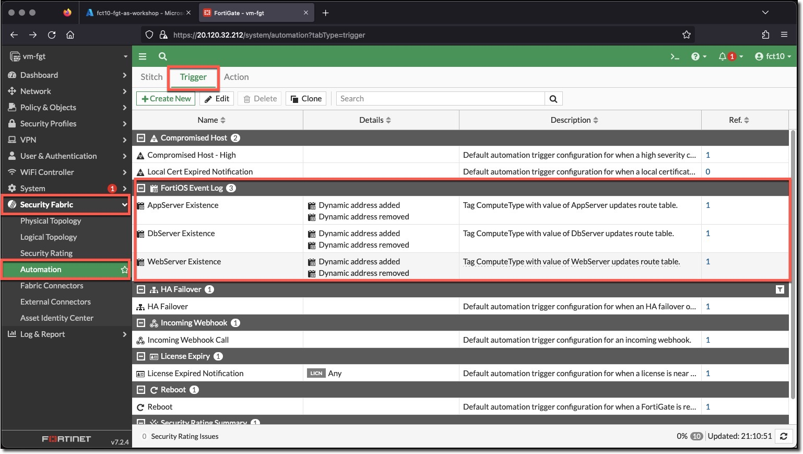
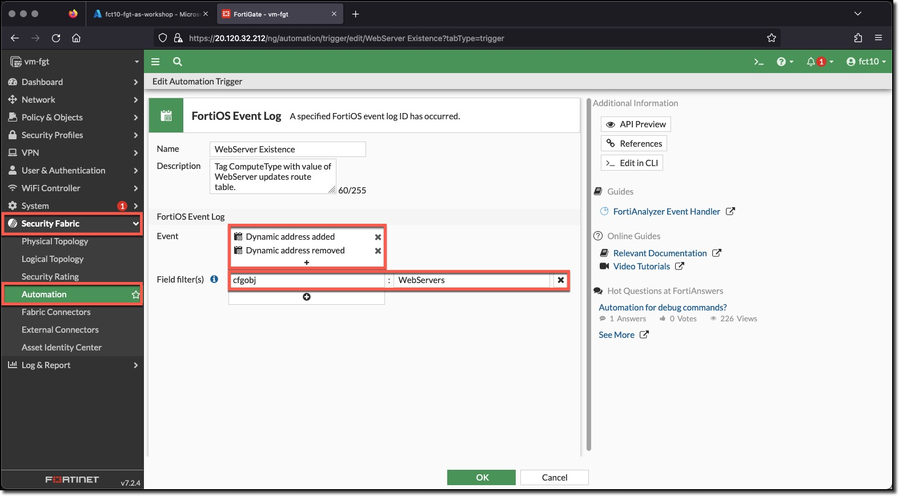
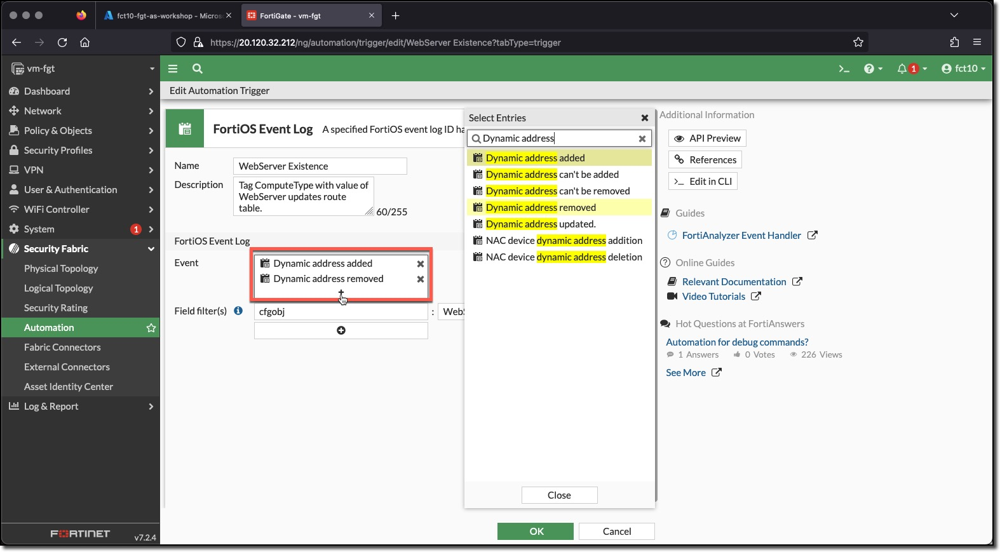
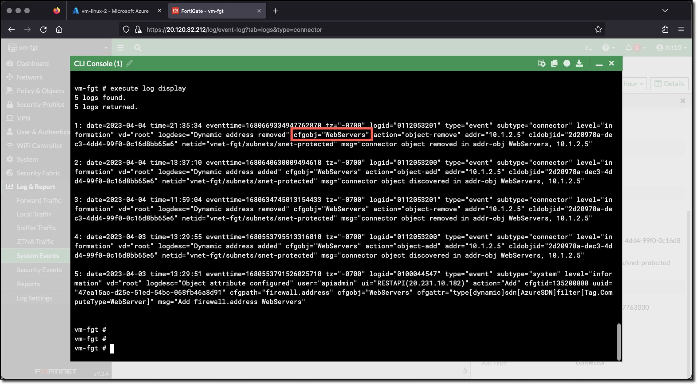

## Create Complex Automation Stitch

A FortiGate Automation Stitch brings together a Trigger and one of more Actions.

FortiGate Automation Stitch Triggers are grouped in Security Fabric, System, Event Log, and Miscellaneous categories. The Miscellaneous category includes

* FortiOS Event Log
* Incoming Webhook
* Schedule

The FortiGate Automation Stitch will be triggered by a log entries related to Dynamic addresses. When a Dynamic address is updated by adding or removing an IP address, the FortiGate Automation Stitch will be triggered. The Dynamic addresses setup previously are updated when a VM with a specific tag and value is discovered or when a previously discovered VM with a specific tag and value is no longer seen in the Azure environment.

* Tag: ComputeType Value: AppServer - updates the AppServers address
* Tag: ComputeType Value: DbServer - updates the DbServers address
* Tag: ComputeType Value: WebServer - updates the WebServers address

A Dynamic address is updated by adding or removing an IP address in the object. Either action creates a FortiGate Event Log, the event logs are named

* Dynamic address added
* Dynamic address removed

### Task 2 - Create an Automation Trigger for each Dynamic Address - AppServers, DbServers, WebSevers

The configurations are presented as a combination of FortiGate CLI commands and screenshots of the configured object.  All of the command blocks can be copied and pasted into the FortiGate CLI console.

1. **Login** to the FortiGate using the IP address and credentials from the Terraform output.
1. **Click** through any opening screens for FortiGate setup actions, no changes are required.
1. **Click** the CLI Console
1. **Enter** the following CLI commands to create an Automation Stitch Trigger for each Dynamic Address

* AppServers

    ```bash
    config system automation-trigger
        edit "AppServer Existence"
            set description "Tag ComputeType with value of AppServer updates route table."
            set event-type event-log
            set logid 53200 53201
            config fields
                edit 1
                    set name "cfgobj"
                    set value "AppServers"
                next
            end
        next
    end
    ```

* DbServers

    ```bash
    config system automation-trigger
        edit "DbServer Existence"
            set description "Tag ComputeType with value of DbServer updates route table."
            set event-type event-log
            set logid 53200 53201
            config fields
                edit 1
                    set name "cfgobj"
                    set value "DbServers"
                next
            end
        next
    end
    ```

* WebServers

    ```bash
    config system automation-trigger
        edit "WebServer Existence"
            set description "Tag ComputeType with value of WebServer updates route table."
            set event-type event-log
            set logid 53200 53201
            config fields
                edit 1
                    set name "cfgobj"
                    set value "WebServers"
                next
            end
        next
    end
    ```

1. View the configured Triggers in the FortiGate UI
    * **Minimize** "CLI Console"
    * **Click** "Security Fabric"
    * **Click** "Automation"
    * **Click** the "Trigger" tab

    

1. View **WebServer Existence** configuration in the FortiGate UI
    * **Double-Click** the **WebServer Existence** trigger

    In the CLI configuration the **logid** was set by specifying the logid number. The **logid** in the CLI is called the **Event** in the UI in the UI **Clicking** the "+" in the event field opens the "Select Entries" dialog, where log events can be searched and selected by name.

    
    

    The "Field filter(s)" for a log event are the logs fields and the value expected in the log field.  In the trigger the Field filter is the log field **cfgobj**. Logs can be viewed in the UI, however, to view raw logs in the CLI, use the `execute log` command and sub-commands. An example of the event logs used in the trigger is shown below.

    
