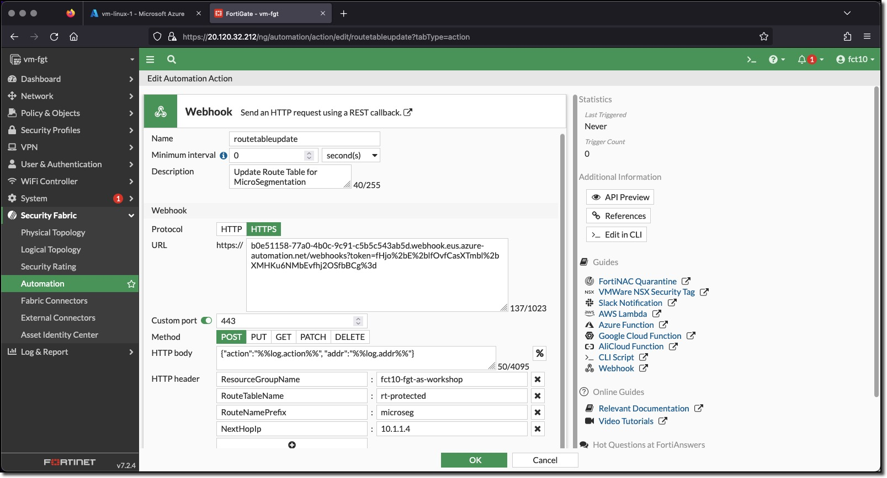

## Create Complex Automation Stitch

A FortiGate Automation Stitch brings together a Trigger and one of more Actions.

The action is to build and send a Webhook. A Webhook is a way to send an HTTP request to a listening endpoint. The endpoint can then do something with the Webhook based on the HTTP method. FortiGate Webhook actions support several HTTP methods; DELETE, GET, PATCH, POST, and PUT.

The Webhook configured in this task uses the POST method. The HTTP POST method will utilize HTTP headers and the request body to send data to the listening endpoint. The listening endpoint was described earlier in the chapter describing Azure Automation.  The Azure Automation Webhook (this is the listening endpoint) was created as part of the Terraform deployment. The Azure Automation Webhook is associated to the Azure Automation Runbook **Update-RouteTable**.

To summarize there are two Webhooks;

* Azure Automation Webhook listens for incoming requests and sends the request to the Azure Automation Runbook **Update-RouteTable**
* FortiGate Automation Stitch Action Webhook sends data in the form of an HTTP POST request to the Azure Automation Webhook

The data sent by the FortiGate Webhook action is sent (POSTed) to the Azure Automation Runbook **Update-RouteTable** where it is parsed and acted upon based on the sent data. Possible runbook actions are

* **Update** the Azure Route table **rt-protected** in the Resource Group USERXX-fgt-as-workshop by adding a host route
* **Update** the Azure Route table **rt-protected** in the Resource Group USERXX-fgt-as-workshop by removing a host route
* **Return** an error message indication that the passed data was incorrect or that the runbook was not executed via the Webhook

The FortiGate Automation Stitch action is triggered by a log entry related to Dynamic addresses, when a Dynamic address is updated by adding or removing an IP address. The Dynamic addresses setup previously are updated when a VM with a specific tag and value is discovered or if a previously discovered VM with a specific tag and value is no longer seen in the Azure environment.

The triggers setup in the last task can all utilize the same action.

### Task 3 - Create Automation Action

1. **Login** to the FortiGate using the IP address and credentials from the Terraform output.
1. **Click** through any opening screens for FortiGate setup actions, no changes are required.
1. **Click** the CLI Console
1. **Enter** the following CLI commands to create an Automation Stitch Action that will send a Webhook to Azure

* There are two options to create the action
  * Replace the values indicated below with the information specific to your deployment. The values can be obtained by running the following terraform commands in the `terraform/azure` directory - **Refer to Chapter 1 Task 2 - Run Terraform**
    * **YOUR_RESOURCE_GROUP** - `terraform output`
    * **YOUR_WEBHOOK** - `terraform output webhook`

  * Use the contents of the file `terraform/fortios/fortigate_automation_action_cli.cfg` - this file was created for this specific deployment when the initial **terraform apply** was executed.

    ```bash
    config system automation-action
        edit "routetableupdate"
            set description "Update Route Table for MicroSegmentation"
            set action-type webhook
            set protocol https
            set uri "YOUR_WEBHOOK"
            set http-body "{\"action\":\"%%log.action%%\", \"addr\":\"%%log.addr%%\"}"
            set port 443
            config http-headers
                edit 1
                    set key "ResourceGroupName"
                    set value "YOUR_RESOURCE_GROUP"
                next
                edit 2
                    set key "RouteTableName"
                    set value "rt-protected"
                next
                edit 3
                    set key "RouteNamePrefix"
                    set value "microseg"
                next
                edit 4
                    set key "NextHopIp"
                    set value "10.1.1.4"
                next
            end
            set verify-host-cert disable
        next
    end
    ```

    

1. View the configured Action in the FortiGate UI
    * **Minimize** "CLI Console"
    * **Click** "Security Fabric"
    * **Click** "Automation"
    * **Click** the "Action" tab

      

1. View **routetableupdate** configuration in the FortiGate UI
    * **Double-Click** the **routetableupdate** trigger

      

  The Action fields

* **Protocol** - HTTP or HTTPS
* **URL** - the Azure Automation Webhook is entered into this field without the **https://** prefix
* **Custom Port** - the port the Azure Automation Webhook is listening on
* **Method** - the HTTPS method
* **HTTP body** - the body of the POST request - in this request the body is formatted as JSON. The items %%log.action%% and %%log.addr%% represent the FortiGate event log fields from the log that triggered the action. These values are:
  * **log.action** - **object-add** or **object-remove**
  * **log.addr** - the IP address of the VM with the **ComputeType** tag
* **HTTP header** - additional header fields - these fields could also have been passed in the HTTP body
  * **ResourceGroupName** - the name of the Azure Resource Group containing the Azure Route table to update
  * **RouteTableName** - the name of the Azure Route table to update
  * **RouteNamePrefix** - a prefix for the routes managed by the Azure Automation Runbook
  * **NextHopIp** - the Next Hop IP Address for the routes managed by the Azure Automation Runbook
