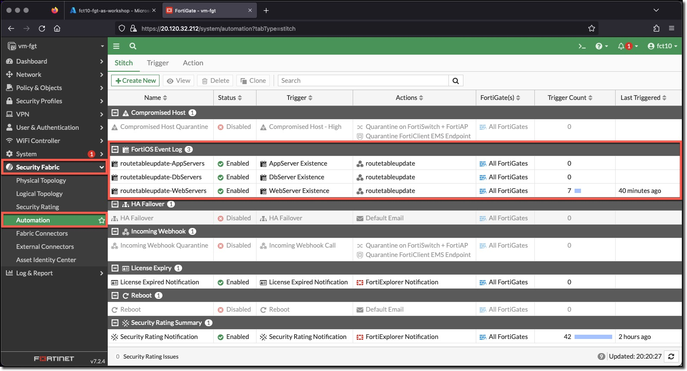
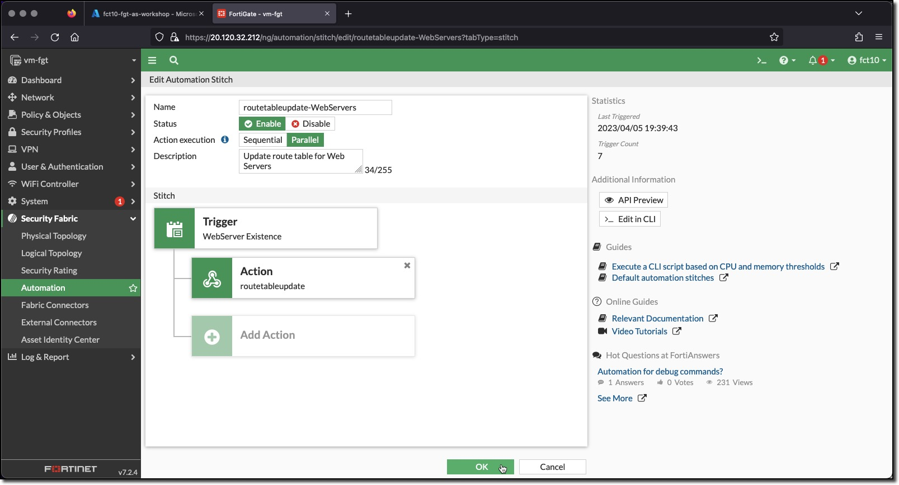

## Create Complex Automation Stitch

A FortiGate Automation Stitch brings together a Trigger and one of more Actions.

Three FortiGate Automation Stitches need to be created, one for each trigger. All the stitches will utilize the same action. Each stitch is used to connect the trigger to one or more actions. The stitches created in this task each only have one action.

### Task 3 - Create Automation Stitches

1. **Login** to the FortiGate using the IP address and credentials from the Terraform output.
1. **Click** through any opening screens for FortiGate setup actions, no changes are required.
1. **Click** the CLI Console
1. **Enter** the following CLI commands to create Automation Stitches to connect the triggers to the action.

* AppServers

    ```bash
    config system automation-stitch
        edit "routetableupdate-AppServers"
            set description "Update route table for App Servers"
            set trigger "AppServer Existence"
            config actions
                edit 1
                    set action "routetableupdate"
                next
            end
        next
    end
    ```

* DbServers

    ```bash
    config system automation-stitch
        edit "routetableupdate-DbServers"
            set description "Update route table for Db Servers"
            set trigger "DbServer Existence"
            config actions
                edit 1
                    set action "routetableupdate"
                next
            end
        next
    end
    ```

* WebServers

    ```bash
    config system automation-stitch
        edit "routetableupdate-WebServers"
            set description "Update route table for Web Servers"
            set trigger "WebServer Existence"
            config actions
                edit 1
                    set action "routetableupdate"
                next
            end
        next
    end
    ```

1. View the configured Action in the FortiGate UI
    * **Minimize** "CLI Console"
    * **Click** "Security Fabric"
    * **Click** "Automation"
    * **Click** the "Stitch" tab

        

1. View **routetableupdate-WebServers** configuration in the FortiGate UI
    * **Double-Click** the **routetableupdate-WebServers** Action

        

The configuration is very simple a single trigger is added and multiple actions can be attached to the trigger.
