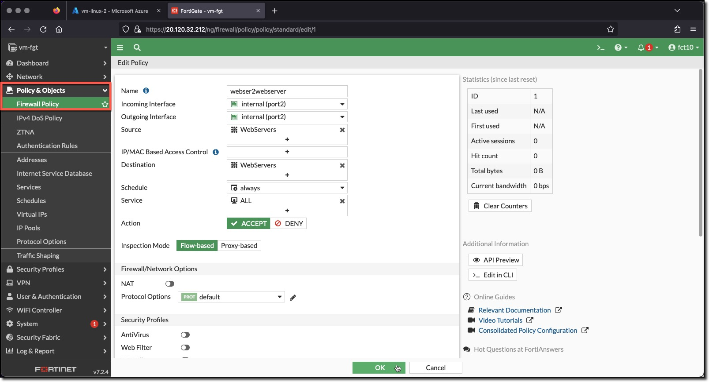

### Task 1 - Create FortiGate Firewall Policy

1. **Login** to the FortiGate using the IP address and credentials from the Terraform output.
1. **Click** through any opening screens for FortiGate setup actions, no changes are required.
1. **Click** the CLI Console
1. **Enter** the following CLI commands to create a FortiGate Firewall Policy "webserver2webserver"

    ```bash
    config firewall policy
        edit 1
            set name "webserver2webserver"
            set srcintf "port2"
            set dstintf "port2"
            set action accept
            set srcaddr "WebServers"
            set dstaddr "WebServers"
            set schedule "always"
            set service "ALL"
        next
    end
    ```

1. View the configured Policy in the FortiGate UI
    * **Minimize** "CLI Console"
    * **Click** "Policy & Objects"
    * **Click** "Firewall Policy"

        

1. View **webserver2webserver** configuration in the FortiGate UI
    * **Double-Click** the **webserver2webserver** Policy

        

Notice that the Dynamic address **WebServers** is used as both the source and destination.
