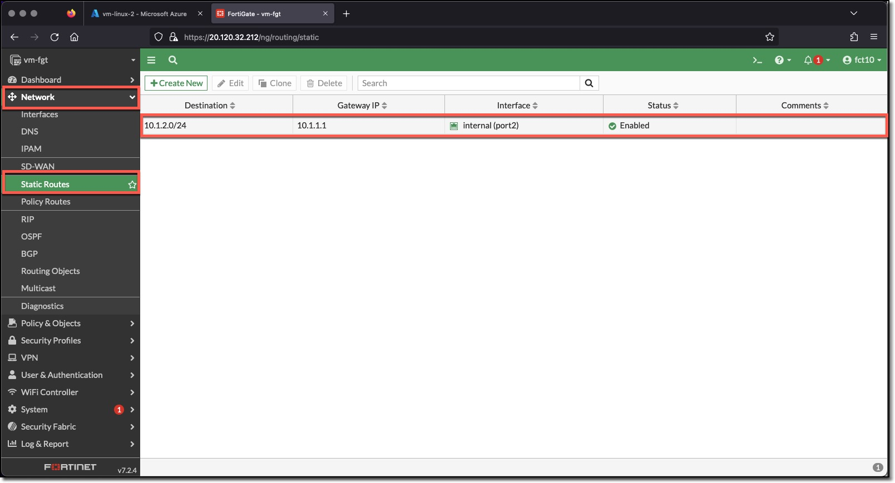
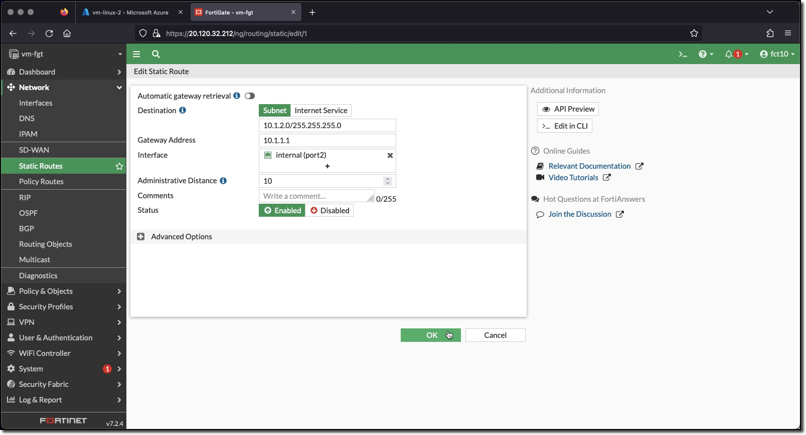

### Task 1 - Create FortiGate Static Route

1. **Login** to the FortiGate using the IP address and credentials from the Terraform output.
1. **Click** through any opening screens for FortiGate setup actions, no changes are required.
1. **Click** the CLI Console
1. **Enter** the following CLI commands to create a FortiGate Static Route "webser2webserver"

    ```bash
    config router static
        edit 1
            set dst 10.1.2.0 255.255.255.0
            set gateway 10.1.1.1
            set device "port2"
        next
    end
    ```

1. View the configured Action in the FortiGate UI
    * **Minimize** "CLI Console"
    * **Click** "Network"

        

1. View **10.1.2.0/24** static route configuration in the FortiGate UI
    * **Double-Click** the **10.1.2.0/24** Policy

        
