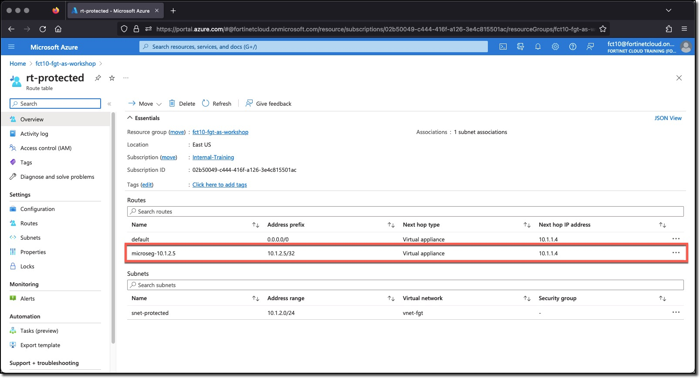
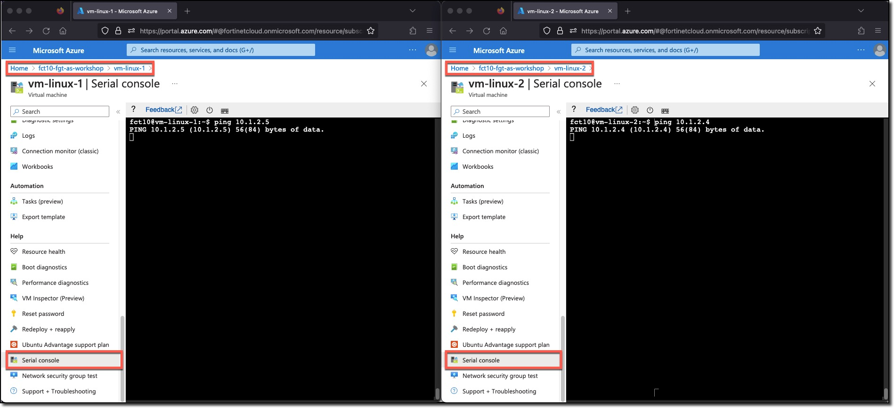

### Task 1 - Ping the linux VMs from each other

1. **Navigate** to the Azure Route table **rt-protected**

There may already be a host route for vm-linux-2 10.1.2.5/32 with a next hop IP 10.1.1.4, FortiGate port2. This route may be here because of the FortiGate Automation Stitch and when vm-linux-2 was deployed it was tagged with "ComputeType=WebServer".

The other VM vm-linux-1 has the tag "ComputeType" but the tag value is set to "unknown". The FortiGate Azure SDN Connector does collect this VM's information each time a scan of the Azure environment is done, however, the Tag and Value do not match any Dynamic address. A FortiGate Automation Stitch is **not** triggered.

For the next steps two browser windows should be open to the Azure environment at the same time.

1. **Navigate** to each linux VM in a separate browser window
1. **Scroll** to the bottom of the left hand navigation
1. **Click** "Serial Console"

From each linux VM ping the other linux VM

1. **Ping** vm-linux-2 from vm-linux-1 - let the ping run even though there is no response
    * `ping 10.1.2.5`
1. **Ping** vm-linux-1 from vm-linux-2 - let the ping run even though there is no response
    * `ping 10.1.2.4`

