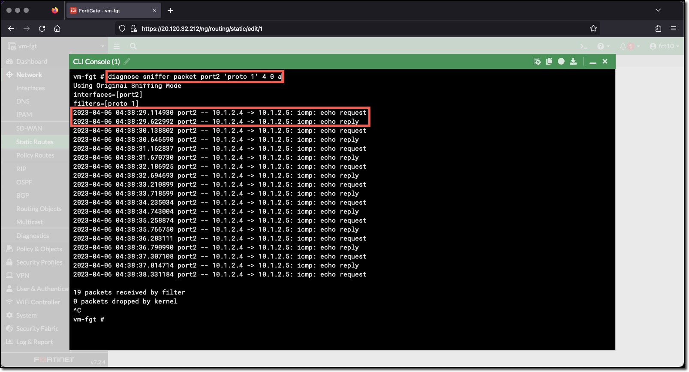

### Task 2 - Sniff the linux VMs ping traffic from the FortiGate

1. **Login** to the FortiGate using the IP address and credentials from the Terraform output.
1. **Click** through any opening screens for FortiGate setup actions, no changes are required.
1. **Click** the CLI Console
1. **Enter** the CLI command to sniff the ping traffic between the two linux VMx
    * `diagnose sniffer packet port2 'proto 1' 4 0 a`

The output of the sniffer command shows:

* vm-linux-1 (10.1.2.4) is sending a ping to 10.1.2.5
* vm-linux-1 (10.1.2.4) is responding to a ping from 10.1.2.5

Two things to realize from this output

* vm-linux-2 (10.1.2.5) **can send traffic directly** to vm-linux-1 (10.1.2.4) because they are in the same subnet and there is **no host route** for vm-linux-1 in the rt-protected Route table because it **vm-linux-1 is not tagged as a WebServer**
* vm-linux-1 (10.1.2.4) **can only communicate** with vm-linux-2 (10.1.2.5) **through the FortiGate** however, the **traffic is dropped** by policy because vm-linux-1 (10.1.2.4) is not in the WebServers Dynamic address.
