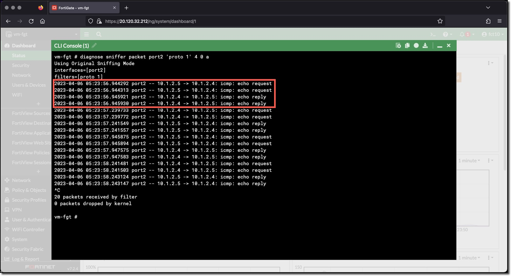

### Task 3 -  Tag the Linux VM vm-linux-1 as a WebServer

1. **Navigate** to the VM vm-linux-1
1. **Click** the "edit" link next to Tags
1. **Change** the "ComputeType" value to "WebServer"
1. **Click** "Save"

Now that the VM vm-linux-1 has a tag **ComputeType** with a value of **WebServer** several actions take place

* FortiGate Azure SDN Connector will return the updated environment information to the FortiGate
* FortiGate Dynamic address "WebServers" will be updated with IP address 10.1.2.4
* FortiGate event log will trigger the FortiGate Automation Stitch to send a Webhook to Azure
* Azure Automation will send the FortiGate Webhook data to the Azure Automation Runbook
* Azure Automation Runbook will run and add a host route for vm-linux-1 to Azure Route table rt-protected
* Traffic will flow between vm-linux-1 and vm-linux-2

These actions **take 2-4 minutes to complete**. The FortiGate Azure SDN Connector scan every 60 seconds. Once the FortiGate Webhook is sent to Azure Automation the Runbook run is queued. When the Azure Automation Runbook completes the Azure Route table updates can take 1-2 minutes to take effect.

Updated Route table - there is a host route for both linux VMs, all traffic for these VMs must go through the FortiGate and match a policy

FortiGate Sniffer - there is bidirectional traffic for the pings

Linux VM Consoles

This concludes the workshop tasks, to explore further

* Update the ComputeType tag value to AppServer and DbServer
* Update the FortiGate Firewall Policy to allow AppServer and DbServer
* Create an Address Group with AppServers, DbServers, and WebServers
* Allow an AppServer to communicate with a DbServer but not with a WebServer
* and so on...
